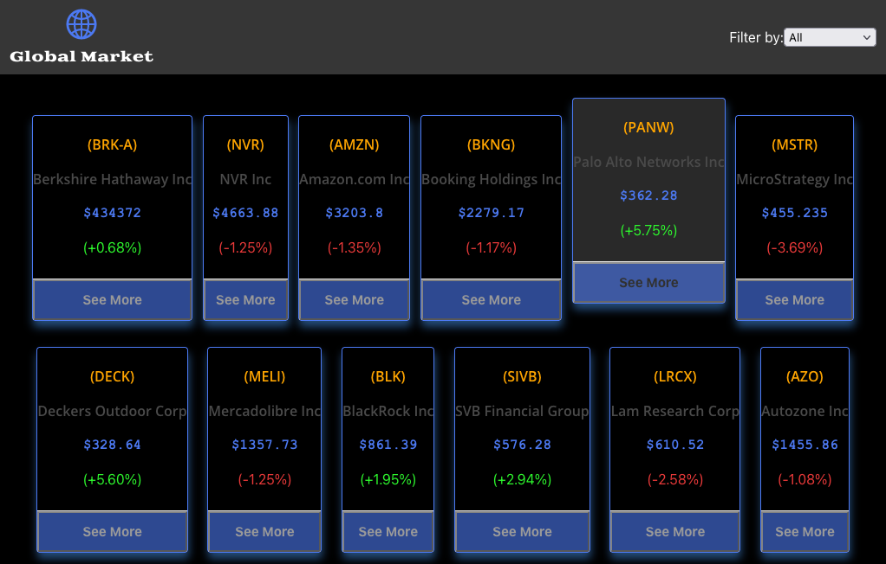

# Catalogue of Statistics
 
> Global Stock is a catalogue of companies on the stock market. The project consists of a frontend application that displays financial information from an API, and stores it in the Redux store. The main features of this app are:

- Ability to display a list of companies
- Filter companies stocks according to categories
- Access the details of each company

### Home Page



### Company Page


## Built With

- JavaScript(ES6)
- React.JS
- gh-pages
- Node.js
- Bulma
- prop-types
- Jest
- Enzyme
- Stock API: [financialmodeling](https://financialmodelingprep.com/developer/docs/)

## Live Version

You can click on this [link](https://brugobi.github.io/stock-react-capstone/)

## Getting Started

### Prerequisites

- Node.js
- Any Brownse
- API KEY from [financialmodeling](https://financialmodelingprep.com/developer/docs/)

To get started open the directory where you will save this repo by typing on your terminal:

```
$ cd <directory>
```

- Clone the repo typing:

```
$ git clone git@github.com:brugobi/stock-react-capstone.git
```
- Install dependencies:

```
$ npm install
```

- Install [dotenv](https://www.npmjs.com/package/dotenv):

```
$ npm install dotenv
```

- in the root create a file called **.env** and add:

```
REACT_APP_STOCK_API_KEY=your API key
```

### Usage

- Sfter set up the API key you can start the React server:

```
$ npm start
```

### Test

- To run the tests:

```
$ npm test
```

## Author

👤 **Bruna Gobi**

- Github: [@brugobi](https://github.com/brugobi)
- Twitter: [@BrunaGobi2](https://twitter.com/BrunaGobi2)
- Linkedin: [bruna-gobi](https://www.linkedin.com/in/bruna-gobi/)

## 🤝 Contributing

Contributions, issues and feature requests are welcome!

## Show your support

Give a ⭐️ if you like this project!
Feel free to check the [issues page](issues/).

## Acknowledgments

- Project requested by [Microverse Program](https://www.microverse.org/).

## 📝 License

This project is [MIT](lic.url) licensed.

